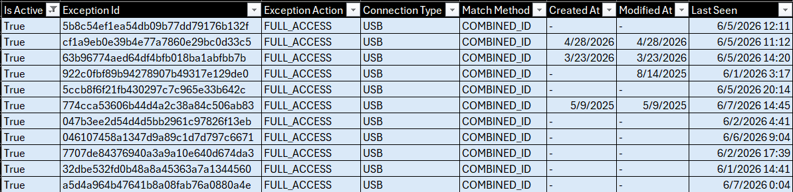

# Crowdstrike USB Device Control Usage

> A reporting toolkit that audits CrowdStrike **Device Control USB exceptions** (the allowlist) against **real-world device usage**, surfacing which exceptions are actually in use and which are dormant — so stale allowlist entries can be reviewed and revoked.

---

## Overview

CrowdStrike Device Control lets you create **exceptions** to allow specific USB devices past your block policy. Over time these allowlists grow, and nobody knows which exceptions are still being used. Every unused exception is an open door that no longer needs to be open.

This toolkit correlates two data sources from the Falcon platform — the **allowlist** (what is permitted) and the **real usage** (what was actually plugged in) — and produces a periodic audit that flags each exception as **active** or **dormant**, turning USB least-privilege hygiene from a guess into evidence.

---

## How It Works

CrowdStrike retains only **~7 days** of device usage history — too short a window to tell whether an exception is genuinely unused. The toolkit works around this with a two-stage pipeline:

- **Stage 1 — Collect.** A weekly job pulls the latest 7-day window of USB activity and appends it to an accumulated dataset (retained up to **6 months**), building the long-term history Falcon itself doesn't keep. A second job snapshots the current exception allowlist.
- **Stage 2 — Audit.** Once enough history exists (**3 months** by default, configurable), the audit cross-references the allowlist against real usage and flags each exception as active or dormant.

> ⏳ **Run the weekly collector consistently.** Because Falcon keeps only ~7 days, any missed week becomes a permanent gap in the history — and the audit is only as good as the history behind it.

---

## Requirements

- **CrowdStrike Falcon** with **Device Control** and **NGSIEM** enabled
- A Falcon **API client** with Device Control and NGSIEM read scopes
- **Python 3.9+**
- USB / removable-storage events ingested into NGSIEM (`DcUsbDevice*`, `DcRemovableStorageDevice*`)

---

## Setup

### 1. Environment and dependencies

```bash
# Virtual environment
python -m venv .venv
.venv\Scripts\Activate.ps1      # Windows (PowerShell)
source .venv/bin/activate        # Linux / macOS

# Install dependencies
pip install -r Scripts/requirements.txt
```

| Dependency | Purpose |
|---|---|
| `crowdstrike-falconpy` | Official CrowdStrike Falcon SDK (Device Control + NGSIEM APIs) |
| `python-dotenv` | Loads API credentials from `.env` |

### 2. API credentials

Create `Scripts/Falcon/.env` with a Falcon API client that has **Device Control** and **NGSIEM** read scopes:

```env
CLIENT_ID="your-falcon-client-id"
SECRET_ID="your-falcon-client-secret"
```

> ⚠️ **Never commit `.env`.** Add it to `.gitignore`. If credentials were ever committed, revoke and rotate them in the Falcon console.

---

## Usage

The pipeline has three scripts. Run them in order:

### 1. `Extract_USB_Devices.py` — collect the allowlist

Pulls **every Device Control policy** and lists **all USB exceptions** defined inside them (vendor/product/serial, match method, action, policy context).

```bash
python Scripts/Falcon/Extract_USB_Devices.py
```
→ `Datas/Entry/Device-Control-USB-Exceptions_<date>.csv`

> ⚠️ Collects only exceptions defined **within policies**. **CID-level (Custom) exceptions** are not retrieved and must be accounted for separately if your environment uses them.

### 2. `Extract_Weekly_Usage.py` — collect real usage *(schedule weekly)*

Runs an **NGSIEM query** for the last **7 days** of USB / removable-storage activity (connections, policy violations, blocks), then merges it into the accumulated usage file — de-duplicating and applying the **6-month retention** window.

```bash
python Scripts/Falcon/Extract_Weekly_Usage.py
```
→ `Datas/Entry/Device-Control-Usage_<range>.csv`

### 3. `Generate_USB-Audit-Usage.py` — run the audit

Cross-references the allowlist against the accumulated usage, flagging each exception as **active** (seen with `Full access` usage) or **dormant**, and enriching it with last-seen date and the machines that connected it.

```bash
python Scripts/Generate_USB-Audit-Usage.py
```
→ `Datas/<YYYY-MM>/Device_USB-Audit-Usage.csv`

> 🔧 The required history depth is set by `BASE_TIME` at the top of the script (**3 months** by default) — edit it to taste.
>
> ✅ The audit matches all three exception types: **`COMBINED_ID`** (by `Device Combined Id`), **`VID_PID_SERIAL`** (by vendor + product + serial), and **`VID_PID`** (by vendor + product). `VID_PID` matches are broader by nature — any device sharing that vendor/product counts as usage.

**Suggested cadence:** schedule step 2 **weekly**; refresh step 1 whenever you audit; run step 3 **monthly**, once `BASE_TIME` months of history have accumulated.

---

## Audit Report Fields

The generated `Device_USB-Audit-Usage.csv` includes the full exception definition plus the usage-derived columns:




| Field | Description |
|---|---|
| `Is Active` | `True` if the device was seen with `Full access` usage |
| `Last Seen` | Most recent usage timestamp for the device |
| `Last Connected Machines` | Hostnames that connected the device |
| `Connection Type` | USB / Storage spaces / PCIe |
| `Match Method` | How the exception is matched against usage: `COMBINED_ID`, `VID_PID_SERIAL`, or `VID_PID` |
| `Device Combined Id` / `Device Vendor Id` / `Device Product Id` / `Device Serial Id` | Device identifiers; which ones are used for matching depends on `Match Method` |
| `Exception Id` / `Exception Action` | The Device Control exception and its action |
| `Policy Name` / `Policy Platform` / `Policy Enabled` | Owning Device Control policy context |
| `USB Enforcement Mode` / `USB Device Class` | Policy enforcement details |
| `Created At` / `Modified At` | Exception lifecycle timestamps |
| `Reference Date` / `Reference Month` / `Reference Year` | When the audit was generated |

---

## File Structure

```
Crowdstrike-USB-Device-Control-Usage/
├── Scripts/
│   ├── Falcon/
│   │   ├── Extract_USB_Devices.py     # Pulls Device Control USB exceptions (API)
│   │   ├── Extract_Weekly_Usage.py    # Pulls weekly USB usage events (NGSIEM)
│   │   └── .env                       # Falcon API credentials (not committed)
│   ├── Generate_USB-Audit-Usage.py    # Cross-references exceptions vs usage
│   └── requirements.txt
├── Datas/
│   ├── Entry/                         # Raw collected CSVs (exceptions + usage)
│   └── <YYYY-MM>/                     # Generated monthly audit reports
└── Files/
    └── usb-audit-report.png           # Example: generated USB audit report
```

---

## Roadmap / Next Steps

- **Automated cleanup** — once the environment is well understood and the audit is trusted, a script that automatically **removes dormant exceptions** via the Device Control API, closing the loop from *detection* to *remediation*.
- **Include CID-level exceptions** in the allowlist extract for full coverage.

---

## License

This toolkit is provided as-is for reference and reuse. Adapt it freely to your environment.
